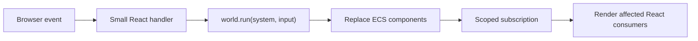

# Learning ECSplain through application UI

This tutorial introduces ECSplain gradually and applies the same small set of
ideas to three complete UI examples:

1. a data table with filtering, sorting, selection, and in-place editing;
2. a form whose active fields depend on another field;
3. an invoice approval workspace with TanStack Query, MSW, optimistic ECS state,
   and monotonic server reconciliation.

It then extends those patterns to CRUD, optimistic updates, notifications,
overlays, drag-and-drop, async validation, ownership, routing, and permissions.

The goal is not to turn browser UI into a game engine. The goal is to use
entities, passive data, and explicit systems to make application state easier
to compose and test.

## Learning path

- **Foundations, sections 1–6:** build a world, query it, write systems, and
  connect scoped React subscriptions.
- **Complete examples, sections 7–9:** study the table, dynamic form, and
  invoice approval workspace in the repository.
- **Application scenarios, sections 10–18:** reuse those patterns for common
  frontend architecture problems.
- **Practice, sections 19–22:** collect recipes, test behavior, understand
  limits, and continue with exercises.

Sections 7–9 are complete runnable repository examples. Sections 10–18 are
focused blueprints: they show component models, system boundaries, and critical
invariants without adding nine separate demo applications.

## 1. The mental model

An Entity Component System separates identity, data, and behavior.

- An **entity** is an opaque identity.
- A **component** is passive data attached to an entity.
- A **component token** identifies one component type at runtime.
- A **system** is a synchronous function that reads and changes the world.
- A **query** finds entities that match required, optional, and excluded
  component terms.
- The **world** owns all entities and component values.

React remains responsible for rendering. Browser events become inputs to ECS
systems, and scoped subscriptions tell React what changed.



This direction is important: systems do not call React, and React components do
not contain filtering, selection, or validation algorithms.

## 2. Create a world

Install the package and create a world:

```sh
npm install ecsplain
```

```ts
import { createWorld } from "ecsplain"

const world = createWorld()
```

A world starts empty. Create an entity when you need a stable identity:

```ts
const task = world.create()
```

The entity does not imply a class or schema. Its capabilities are determined by
the components currently attached to it.

## 3. Define and attach components

Define component tokens once at module scope:

```ts
import { defineComponent } from "ecsplain"

interface TaskData {
	readonly title: string
	readonly completed: boolean
}

const Task = defineComponent<TaskData>("Task")
const Selected = defineComponent<true>("Selected")
const Archived = defineComponent<true>("Archived")
```

`Task` stores record data. `Selected` is a marker component: its presence is the
state.

Attach values with `set`:

```ts
world.set(task, Task, {
	title: "Read the ECSplain tutorial",
	completed: false,
})
world.set(task, Selected, true)
```

When the initial components are already known, create the complete entity in
one notification batch:

```ts
const secondTask = world.spawn(
	[
		Task,
		{
			title: "Try the table example",
			completed: false,
		},
	],
	[Selected, true],
)
```

Each spawn entry is a `[component, value]` pair. TypeScript checks every value
against its token.

Read and inspect components:

```ts
const currentTask = world.get(task, Task)
const isSelected = world.has(task, Selected)
```

Use `require` when absence means the application invariant is broken:

```ts
const taskData = world.require(task, Task)
```

Unlike `get`, `require` throws a diagnostic error instead of returning
`undefined`.

Remove a capability or state by removing its component:

```ts
world.remove(task, Selected)
```

`undefined` is reserved for a missing component and cannot be stored as a
component value.

### Replace values instead of mutating them

Component reads are readonly at the type level. Update object components by
returning a new value:

```ts
world.update(task, Task, current => ({
	...current,
	completed: true,
}))
```

Do not mutate an object returned by `get`. ECSplain detects changes at the
`set`, `update`, and `remove` boundary; it does not use proxies or deep
observation.

## 4. Query by capabilities

A query returns entities that have every required component:

```ts
for (const [entity, taskData] of world.query(Task)) {
	console.log(entity, taskData.title)
}
```

Combining tokens narrows the result:

```ts
for (const [entity, taskData] of world.query(Task, Selected)) {
	console.log("Selected:", entity, taskData.title)
}
```

Use `optional` to read a component without requiring it, and `without` to
exclude entities:

```ts
import { defineQuery, optional, without } from "ecsplain"

const VisibleTasks = defineQuery(
	Task,
	optional(Selected),
	without(Archived),
)

for (const [entity, taskData, selected] of world.query(VisibleTasks)) {
	console.log(entity, taskData.title, selected === true)
}
```

A normal token is required and contributes its value to the result tuple.
`optional(Selected)` contributes `true | undefined`. `without(Archived)`
changes membership but contributes no value. `defineQuery` freezes these terms
in a reusable descriptor that can be shared by systems and React.

When exactly one entity must match, encode that invariant directly:

```ts
const [selectedTask, taskData] = world.single(Task, Selected)
```

`single` throws when zero or multiple entities match.

Queries are deterministic snapshots ordered by entity ID. They are safe to
iterate while changing the world because the result is not a live collection.

This makes marker components useful for application state:

- `Selected` identifies selected items;
- `ActiveField` identifies fields in the current form structure;
- `CellDraft` identifies the cell currently being edited;
- `FieldError` identifies invalid fields.

## 5. Put behavior in systems

A system is a typed function. It receives the world and an input:

```ts
import type { Entity, System } from "ecsplain"

interface ToggleTaskInput {
	readonly task: Entity
}

const toggleTask: System<ToggleTaskInput> = (world, { task }) => {
	world.update(task, Task, current => ({
		...current,
		completed: !current.completed,
	}))
}

world.run(toggleTask, { task })
```

Systems give state changes names and make them testable without React.

Use nested systems to compose behavior:

```ts
const clearSelection: System = world => {
	for (const [entity] of world.query(Selected)) {
		world.remove(entity, Selected)
	}
}

const selectOnly: System<{ readonly entity: Entity }> = (
	world,
	{ entity },
) => {
	world.run(clearSelection)
	world.set(entity, Selected, true)
}
```

`world.run` batches nested changes. Subscribers observe one completed batch
instead of every intermediate write.

### Observe explicitly-run systems with middleware

`createWorld` accepts synchronous observing middleware around every
`world.run`, including nested runs:

```ts
import type { SystemMiddleware } from "ecsplain"

const trace: SystemMiddleware = (execution, next) => {
	const startedAt = performance.now()

	try {
		return next()
	} finally {
		console.info("ecsplain:system", {
			system: execution.system.name,
			depth: execution.depth,
			durationMs: performance.now() - startedAt,
		})
	}
}

const tracedWorld = createWorld({ middleware: [trace] })
```

Registration order is outside-in, and `depth` is zero-based: an entry system
has depth `0`, while a system it runs directly has depth `1`. Middleware must
call `next()` exactly once, return its exact result, and rethrow its exact error.
It cannot skip a system, replace its input or output, turn execution async, or
provide rollback. Subscriber notification happens after the outer middleware
chain finishes.

Treat `Function.name` as diagnostic only because a bundler may change it.
Tracing should not log raw system input by default; application input can
contain sensitive data. The full rationale and contract are recorded in
[ADR 0003](./adr/0003-synchronous-observing-system-middleware.md).

### Errors do not roll changes back

ECSplain systems are synchronous batches, not database transactions. If a
system writes a component and then throws, the write remains and subscribers
are notified once before the error is rethrown.

Validate external input before making writes when partial state would be
invalid.

## 6. Connect a world to React

The React adapter is a separate entry point:

```tsx
import { WorldProvider } from "ecsplain/react"

root.render(
	<WorldProvider world={world}>
		<App />
	</WorldProvider>,
)
```

React event handlers should be thin:

```tsx
function ToggleButton({ task }: { readonly task: Entity }) {
	const world = useWorld()

	return (
		<button
			type="button"
			onClick={() => world.run(toggleTask, { task })}
		>
			Toggle
		</button>
	)
}
```

The handler translates a browser event into plain system input. The system
still works in a unit test with no DOM.

### Render a query

`useQuery` subscribes to the requested component tokens:

```tsx
import { useQuery, useQuerySelector } from "ecsplain/react"

function TaskList() {
	const tasks = useQuery(VisibleTasks)

	return (
		<ul>
			{tasks.map(([entity, task, selected]) => (
				<li key={entity}>
					{task.title} {selected ? "(selected)" : ""}
				</li>
			))}
		</ul>
	)
}
```

Changing an unrelated component token does not wake this subscription.
Required, optional, and excluded tokens are all subscription dependencies.

### Select a value from a query

Use `useQuerySelector` when a view needs an aggregate or another small derived
value rather than the complete rows:

```tsx
function VisibleTaskCount() {
	const count = useQuerySelector(VisibleTasks, tasks => tasks.length)
	return <output>{count}</output>
}
```

The hook accepts a `defineQuery` descriptor. React does not rerender the
consumer when the selected value remains `Object.is`-equal. Pass a third
equality function for derived arrays or objects.

### Read one entity-component pair

Use `useComponent` when the entity is already known:

```tsx
function SelectionState({ task }: { readonly task: Entity }) {
	const selected = useComponent(task, Selected) === true
	return <output>{selected ? "Selected" : "Not selected"}</output>
}
```

This subscription is scoped to exactly `task + Selected`.

### Read one field from a larger component

Use `useComponentSelector` when a component contains a record but a view only
needs one field:

```tsx
function TaskTitle({ task }: { readonly task: Entity }) {
	const title = useComponentSelector(task, Task, value => value.title)
	return <span>{title}</span>
}
```

When `Task` is replaced, React compares the selected snapshot with `Object.is`.
A change to `completed` does not rerender `TaskTitle` if `title` stays equal.

Keep subscriptions near the UI that consumes them. For example, the table
selection count lives in its own toolbar component. If the root screen
subscribed to selection, each selection change would rerender the screen's
entire React subtree even though ECS subscriptions were scoped correctly.

## 7. Scenario: model a data table

Run the complete example:

```sh
npm run dev:table
```

The source is in [`examples/table`](../examples/table).

### Start from identities, not DOM nodes

The example uses four entity roles:

| Entity | Components | Responsibility |
| --- | --- | --- |
| Table | `TableFilters`, `TableSort`, `TableView`, `SelectionGesture` | Table-level state |
| Row | `UserRow` | One authoritative saved record |
| Column | `TableColumn` | Stable field metadata and editor type |
| Cell | `TableCell`, optional selection/edit components | Stable row-column coordinate and interaction state |

The important choice is that a cell entity does not store a saved copy of its
display value:

```ts
interface TableCellData {
	readonly row: Entity
	readonly column: Entity
}
```

The cell points to a row and column. `UserRow` is the single authoritative
source:

```ts
interface UserRowData {
	readonly name: string
	readonly email: string
	readonly role: "Admin" | "Editor" | "Viewer"
	readonly status: "Active" | "Inactive"
}
```

This avoids synchronizing a value on both the row and every cell. A
`CellDraft` is allowed because it represents uncommitted input, not a second
saved value.

See the complete component model in
[`model.ts`](../examples/table/src/model.ts).

### Build stable cell entities once

Bootstrap creates every row-column coordinate:

```ts
for (const user of users) {
	const row = world.spawn([UserRow, user])

	for (const column of columns) {
		world.spawn([TableCell, { row, column }])
	}
}
```

Sorting and filtering do not recreate cells. Selection and draft state
therefore remain attached to stable identities until a system explicitly
clears or reconciles them.

The real bootstrap is in
[`bootstrap.ts`](../examples/table/src/bootstrap.ts).

### Keep render order in a derived view

The table entity owns `TableView`, a derived snapshot:

```ts
interface TableViewData {
	readonly columns: readonly Entity[]
	readonly rows: readonly {
		readonly row: Entity
		readonly cells: readonly Entity[]
	}[]
}
```

`rebuildTableView`:

1. queries visible column entities;
2. indexes cell entities by row and column;
3. filters row entities;
4. sorts rows;
5. emits aligned cell entities for rendering.

React renders this result but does not perform the filter or sort itself. Read
the full system in
[`view-system.ts`](../examples/table/src/view-system.ts).

Derived state is manually maintained in this small framework. Any system that
changes a value used by filtering, sorting, or structure must rebuild
`TableView`. A direct `world.set(row, UserRow, ...)` can violate that invariant;
application code should route row changes through table systems.

### Filters and sorting are table systems

The filtering flow is:

1. try to commit the active edit;
2. replace `TableFilters`;
3. clear selection as required by the interaction contract;
4. rebuild `TableView`.

The sort system follows the same pattern. Centralizing this sequence prevents
individual controls from forgetting one of the rules.

See [`table-systems.ts`](../examples/table/src/table-systems.ts).

### Selection is a marker component

Selected cells have `SelectedCell`; unselected cells do not.

```ts
const desired = new Set<Entity>(cellsInRectangle)

for (const [cell] of world.query(SelectedCell)) {
	if (!desired.has(cell)) {
		world.remove(cell, SelectedCell)
	}
}

for (const cell of desired) {
	if (!world.has(cell, SelectedCell)) {
		world.set(cell, SelectedCell, true)
	}
}
```

A drag gesture is transient table data:

```ts
interface SelectionGestureData {
	readonly anchor: Entity
	readonly current: Entity
	readonly additive: boolean
	readonly baseSelection: readonly Entity[]
}
```

The anchor and current cell are converted to positions in the current
`TableView`. The rectangle between them becomes the desired selection.

For `Ctrl`/`Cmd` additive selection, the system starts from `baseSelection` and
unions the current rectangle. Because the base is captured at pointer-down,
shrinking a drag does not accidentally erase the earlier selection.

Row and column selection use the same `SelectedCell` marker and the same
`applySelection` helper. There is no separate selection representation for
each interaction.

See [`selection-systems.ts`](../examples/table/src/selection-systems.ts) and
[`selection-state.ts`](../examples/table/src/selection-state.ts).

### In-place editing is an explicit state machine

Editing uses cell-level components:

- `FocusedCell` marks the keyboard target;
- `CellDraft` stores uncommitted text;
- `CellError` stores validation feedback;
- `UserRow` remains the saved source.

The lifecycle is:

```text
idle
  -> begin edit: create CellDraft
  -> change: replace CellDraft
  -> invalid commit: keep CellDraft + add CellError
  -> valid commit: replace UserRow + remove draft/error
  -> cancel: remove draft/error without changing UserRow
```

Column metadata chooses the editor and commit behavior. Text columns trim and
validate strings, while option columns only accept known values.

An invalid edit blocks filtering, sorting, and changing focus. Otherwise those
operations could hide the editor while leaving an unresolved draft.

See [`editing-systems.ts`](../examples/table/src/editing-systems.ts) and
[`columns.ts`](../examples/table/src/columns.ts).

### Subscribe at cell granularity

Each rendered cell reads:

- its own address, selection, focus, draft, and error components;
- its column metadata;
- one selected field from its row's `UserRow`.

```tsx
const selected = useComponent(cell, SelectedCell) === true
const value = useComponentSelector(row, UserRow, user =>
	columnBehaviors[columnKey].read(user),
)
```

A normal selection gesture does not replace `TableView`, so only the selection
toolbar and affected cell subscriptions update. A committed edit currently
rebuilds the derived view because it may alter filter membership or sort order;
that structural update can rerender the table container.

See [`Cell.tsx`](../examples/table/src/Cell.tsx) and
[`App.tsx`](../examples/table/src/App.tsx).

## 8. Scenario: model a conditional form

Run the second example:

```sh
npm run dev:form
```

The source is in [`examples/dynamic-form`](../examples/dynamic-form).

### Make every field an entity

Every field has metadata and a preserved value:

```ts
const FormField = defineComponent<FormFieldData>("FormField")
const FieldValue = defineComponent<{ readonly value: string }>("FieldValue")
```

Optional components describe current capabilities:

```ts
const ActiveField = defineComponent<true>("ActiveField")
const DeliveryBranch =
	defineComponent<{ readonly method: "courier" | "pickup" }>(
		"DeliveryBranch",
	)
const FieldError =
	defineComponent<{ readonly message: string }>("FieldError")
```

A field is rendered because it has `ActiveField`, not because React contains a
matching conditional expression.

### Change structure by adding and removing a marker

The delivery method system synchronizes branch membership:

```ts
const DeliveryBranches = defineQuery(
	DeliveryBranch,
	optional(ActiveField),
)

const syncDeliveryBranch: System = world => {
	const method = readDeliveryMethod(world)

	for (const [field, branch, active] of world.query(DeliveryBranches)) {
		if (branch.method === method && active === undefined) {
			world.set(field, ActiveField, true)
		} else if (branch.method !== method && active !== undefined) {
			world.remove(field, ActiveField)
		}
	}
}
```

The active-field query is defined once and shared by systems and React:

```tsx
const ActiveFormFields = defineQuery(FormField, FieldValue, ActiveField)
const fields = useQuery(ActiveFormFields)
```

Changing the marker changes the query structure and therefore the rendered
controls.

See [`systems.ts`](../examples/dynamic-form/src/systems.ts) and
[`App.tsx`](../examples/dynamic-form/src/App.tsx).

### Preserve inactive branch values

Switching from courier delivery to pickup removes `ActiveField` from city and
address entities. It does not remove `FieldValue`.

When the user switches back, the same field entities become active and their
previous values reappear. No extra cache or React state is required.

This pattern works for:

- account type-specific settings;
- payment method details;
- shipping versus pickup;
- advanced sections;
- wizard steps whose values should survive backtracking.

### Validate the current structure

Submission queries only active fields:

```ts
for (const [field, definition, fieldValue] of world.query(ActiveFormFields)) {
	const value = fieldValue.value.trim()

	if (value.length === 0) {
		world.set(field, FieldError, {
			message: `${definition.label} is required.`,
		})
	}
}
```

Inactive values are preserved in the world but excluded from validation and
submission. Structure, validation, and serialization all use the same
`ActiveField` rule.

## 9. Complete example: approve invoices with server data

Run the third complete example:

```sh
npm run dev:invoice
```

The source is in
[`examples/invoice-approval`](../examples/invoice-approval). Use
`?variant=review` to require confirmation before approval, or `?approval=off`
to open a read-only workspace.

The core ECS API remains synchronous even though the workspace loads and
updates invoices over HTTP. The example keeps that boundary explicit by giving
each kind of state one owner:

| State | Owner |
| --- | --- |
| Fetch status, cancellation, stale time, and remote cache | TanStack Query |
| Invoice working-set projection and approval workflow | ECSplain |
| Delayed mock responses and server versions | MSW |

TanStack Query is the only HTTP cache. ECS does not copy Query's loading or
retry state; it stores the invoice snapshots that synchronous systems need,
plus local review, pending, error, capability, and rollout components.

### Reconcile one query into the ECS working set

The application creates one Query options object. React uses it to render
loading and refresh state, while a query-specific `QueryObserver` bridges
successful data into ECS:

```ts
const observer = new QueryObserver(queryClient, queryOptions)

const unsubscribe = observer.subscribe(result => {
	if (result.isSuccess) {
		world.run(reconcileInvoices, {
			workspace,
			response: result.data,
		})
	}
})
```

The real bridge also applies an already-successful current result and skips an
identical data reference. It observes only the invoice query rather than
mirroring the complete Query cache. React and the bridge share the same Query
options, so TanStack Query deduplicates their initial request.

### Accept only a newer server version

Every server-visible invoice change increments a per-invoice `version`.
`applyInvoiceSnapshot` is the single ECS gate for list and mutation responses:

```ts
const current = world.get(entity, InvoiceSnapshot)

if (current !== undefined && invoice.version <= current.version) {
	return { entity, applied: false }
}

world.set(entity, InvoiceSnapshot, toInvoiceSnapshot(invoice))
syncCanApprove(world, entity, invoice.canApprove)
return { entity, applied: true }
```

The workspace locates entities through a unique `InvoiceId` secondary index.
An older or duplicate response cannot regress the snapshot or its
`CanApprove` capability. Reconciliation changes only workspace-owned snapshot
components, so local `ApprovalReview`, `PendingApproval`, and `ApprovalError`
state survives a background refresh.

### Let ECS own optimistic workflow state

A React handler first runs a synchronous approval system. The system validates
the session rollout, current server status, `CanApprove`, and duplicate pending
state. It then attaches `PendingApproval` or opens `ApprovalReview` and returns
a plain command for the async adapter:

```ts
const command = world.run(requestInvoiceApproval, {
	workspace: workspaceEntity,
	invoice,
})

if (command !== undefined) {
	await submitInvoiceApproval({
		api: approvalApi,
		command,
		queryClient,
		workspace,
		world,
	})
}
```

ECS is the only owner of optimistic UI. The Query cache is not optimistically
changed and therefore needs no rollback. A successful POST is applied to ECS
first; only when the version gate accepts it does the adapter merge it into the
Query cache. A failure clears pending state, preserves the accepted snapshot,
and attaches the normalized server message.

### Make races explicit at the remote boundary

Before sending the approval POST, the adapter cancels the active invoice query.
The query function passes TanStack Query's `AbortSignal` to `fetch`, so a
delayed GET from the previous server state is aborted. Both the ECS projection
and the Query-cache merge independently reject equal or lower versions.

Success and failure both invalidate the invoice query after local handling.
That background request verifies the final server state while cached ECS rows
remain visible. There is no transaction across `QueryClient` and the World;
ordering and monotonic versions provide the consistency rule.

### Compose flags, effects, and tracing at the application root

The application root resolves the approval flag and direct/review variant from
the URL once, then constructs one World, QueryClient, unique index, query
bridge, API pair, and disposal function. Feature slices receive these
dependencies rather than reading browser globals.

The same root installs synchronous observing middleware for system tracing.
It records diagnostic system name, nesting depth, duration, and outcome without
logging invoice inputs. MSW starts before the query observer and React render,
so the browser example and Vitest integration tests reuse the same request
handlers without a real backend.

See the [example README](../examples/invoice-approval/README.md) for the
vertical-slice dependency direction, endpoints, and detailed approval flow.

## 10. Scenario: build a master-detail CRUD screen

A master-detail screen has a list of entities, a selected entity, and a detail
editor. It combines the table's stable row identities with the form's draft
state.

### Keep records normalized

Each saved record is one entity:

```ts
interface CustomerData {
	readonly name: string
	readonly email: string
}

const Customer = defineComponent<CustomerData>("Customer")
const SelectedCustomer = defineComponent<true>("SelectedCustomer")
const CustomerDraft = defineComponent<CustomerData>("CustomerDraft")
const CustomerError =
	defineComponent<{ readonly message: string }>("CustomerError")
```

Related data refers to the customer entity instead of embedding a second
customer object:

```ts
interface OrderData {
	readonly customer: Entity
	readonly total: number
}

const Order = defineComponent<OrderData>("Order")
```

Changing a customer does not require rewriting every order.

### Separate selection from editing

Selecting a record changes the detail target:

```ts
const selectCustomer: System<{ readonly customer: Entity }> = (
	world,
	{ customer },
) => {
	for (const [selected] of world.query(SelectedCustomer)) {
		world.remove(selected, SelectedCustomer)
	}

	world.set(customer, SelectedCustomer, true)
}
```

Beginning an edit copies saved data into a draft:

```ts
const beginCustomerEdit: System<{ readonly customer: Entity }> = (
	world,
	{ customer },
) => {
	const current = world.require(customer, Customer)

	world.set(customer, CustomerDraft, { ...current })
	world.remove(customer, CustomerError)
}
```

The editor reads `CustomerDraft`; list rows continue to read `Customer`. A
cancel removes the draft, while a successful save replaces `Customer`.

### Make create and delete repair dependent state

Creating a record is a system that creates an entity, attaches its initial
components, and usually selects it:

```ts
const createCustomer: System<void, Entity> = world => {
	const customer = world.spawn([Customer, { name: "", email: "" }])
	world.run(selectCustomer, { customer })
	world.run(beginCustomerEdit, { customer })
	return customer
}
```

### Index stable external IDs

An ECS entity is an internal identity, while API and database IDs are domain
data. Store an external ID in its own component and index that component:

```ts
const CustomerId = defineComponent<string>("CustomerId")
const customersById = world.index(CustomerId, { unique: true })

const customer = world.spawn(
	[CustomerId, "customer-42"],
	[Customer, { name: "Ada", email: "ada@example.test" }],
)

customersById.get("customer-42") === customer
```

A unique index rejects conflicting writes before changing the component.
Without `{ unique: true }`, `get(key)` returns all matching entity IDs in
deterministic order. Indexes update synchronously on `set`, `update`, `remove`,
and `destroy`, so a system can write a key and immediately look it up.

Index equality follows JavaScript `Map` semantics over the complete component
value. Separate scalar components such as `CustomerId`, `TenantId`, or
`OwnedBy` make durable lookup behavior explicit.

Deletion must address relationships and selection explicitly:

1. delete or reassign orders that reference the customer;
2. remove the customer entity;
3. select a neighboring customer or clear the detail panel;
4. rebuild any derived list view.

ECSplain does not infer these ownership rules. Keeping them in one delete
system makes the business decision visible and testable.

## 11. Scenario: optimistic updates and explicit undo

An optimistic UI updates immediately and reconciles with the server later.
Because ECSplain has no automatic rollback, store the information required to
undo the exact mutation.

### Record the previous value

```ts
interface PendingCustomerSaveData {
	readonly mutationId: string
	readonly previous: CustomerData
	readonly optimistic: CustomerData
}

const PendingCustomerSave =
	defineComponent<PendingCustomerSaveData>("PendingCustomerSave")
const SaveError = defineComponent<{ readonly message: string }>("SaveError")
```

Start the optimistic mutation synchronously:

```ts
const beginOptimisticSave: System<{
	readonly customer: Entity
	readonly mutationId: string
	readonly next: CustomerData
}> = (world, input) => {
	const previous = world.get(input.customer, Customer)
	if (previous === undefined) {
		throw new Error("Cannot save an entity without Customer")
	}

	world.set(input.customer, PendingCustomerSave, {
		mutationId: input.mutationId,
		previous,
		optimistic: input.next,
	})
	world.set(input.customer, Customer, input.next)
	world.remove(input.customer, SaveError)
}
```

The async controller sends `next` to the server. Confirmation removes
`PendingCustomerSave`.

### Reject only the matching mutation

If a user saves twice before the first response returns, the first failure must
not undo the second optimistic value:

```ts
const rejectOptimisticSave: System<{
	readonly customer: Entity
	readonly mutationId: string
	readonly message: string
}> = (world, input) => {
	const pending = world.get(input.customer, PendingCustomerSave)

	if (pending?.mutationId !== input.mutationId) {
		return
	}

	world.set(input.customer, Customer, pending.previous)
	world.remove(input.customer, PendingCustomerSave)
	world.set(input.customer, SaveError, { message: input.message })
}
```

The mutation ID plays the same role as the request ID in async loading.

### Model user-driven undo separately

Server rejection and user undo are different events. For a general undo
history, create an entity per reversible command:

```ts
interface UndoEntryData {
	readonly target: Entity
	readonly sequence: number
	readonly before: CustomerData
	readonly after: CustomerData
}

const UndoEntry = defineComponent<UndoEntryData>("UndoEntry")
```

An undo system queries entries, chooses the highest sequence, restores
`before`, and destroys that history entity. Limit history explicitly so
transient entities do not grow forever.

## 12. Scenario: manage toast notifications

Toasts are short-lived independent items, so each toast is naturally an
entity.

```ts
type ToastKind = "info" | "success" | "error"

const Toast = defineComponent<{
	readonly message: string
	readonly kind: ToastKind
}>("Toast")

const ToastExpiry = defineComponent<{
	readonly expiresAt: number
}>("ToastExpiry")
```

Creating a toast returns its identity:

```ts
const showToast: System<{
	readonly message: string
	readonly kind: ToastKind
	readonly expiresAt: number
}, Entity> = (world, input) => {
	return world.spawn(
		[
			Toast,
			{
				message: input.message,
				kind: input.kind,
			},
		],
		[ToastExpiry, { expiresAt: input.expiresAt }],
	)
}
```

React renders `useQuery(Toast)`. A close button runs a system that destroys one
toast entity.

### Pass time into the world

Systems should not own an invisible timer loop. A small external controller can
schedule the next expiry or periodically provide the current time:

```ts
const expireToasts: System<{ readonly now: number }> = (world, { now }) => {
	for (const [toast, expiry] of world.query(ToastExpiry)) {
		if (expiry.expiresAt <= now) {
			world.destroy(toast)
		}
	}
}
```

Passing `now` makes expiry deterministic in tests. Fake timers are only needed
for the controller that invokes the system.

## 13. Scenario: coordinate modals and overlays

Use a stable screen entity when only one modal may be active:

```ts
type ModalKind = "delete-customer" | "edit-settings"

interface ActiveModalData {
	readonly kind: ModalKind
	readonly subject: Entity | null
}

const ActiveModal = defineComponent<ActiveModalData>("ActiveModal")
```

Opening and closing are explicit systems:

```ts
const openDeleteModal: System<{
	readonly screen: Entity
	readonly customer: Entity
}> = (world, { screen, customer }) => {
	world.set(screen, ActiveModal, {
		kind: "delete-customer",
		subject: customer,
	})
}

const closeModal: System<{ readonly screen: Entity }> = (world, { screen }) => {
	world.remove(screen, ActiveModal)
}
```

The modal host subscribes only to `screen + ActiveModal`.

Keep DOM responsibilities in React:

- move focus into the dialog;
- restore focus when it closes;
- trap focus;
- handle `Escape`;
- apply the correct dialog semantics.

ECS describes which overlay is active and its subject. It should not store DOM
nodes or call focus APIs.

If multiple overlays can coexist, model each as an entity with `OpenOverlay`
and an ordering component instead of placing an array inside one singleton.

## 14. Scenario: build a Kanban drag-and-drop board

Kanban adds mutable relationships and ordering to the transient gesture pattern
used by table selection.

```ts
const BoardColumn = defineComponent<{ readonly title: string }>("BoardColumn")
const Card = defineComponent<{ readonly title: string }>("Card")
const CardPlacement = defineComponent<{
	readonly column: Entity
	readonly order: number
}>("CardPlacement")
```

The card entity owns content. `CardPlacement` determines where it appears.

### Keep the drag session transient

Store the semantic drag state on the board entity:

```ts
interface DragSessionData {
	readonly card: Entity
	readonly fromColumn: Entity
	readonly overColumn: Entity
	readonly overIndex: number
}

const DragSession = defineComponent<DragSessionData>("DragSession")
```

Pointer handlers translate DOM hit testing into `overColumn` and `overIndex`.
Systems do not need DOM rectangles or element references.

The drop system:

1. validates that the card and target column still exist;
2. computes the new order;
3. replaces `CardPlacement`;
4. normalizes sibling order if necessary;
5. removes `DragSession`.

Canceling removes only `DragSession`, leaving saved placement unchanged.

For small boards, integer order values and normalization are sufficient. For
large collaborative boards, fractional ranking or server-assigned positions
may avoid rewriting many siblings.

Test the reorder system with entity IDs and indices. Keep pointer-coordinate
tests in E2E.

## 15. Scenario: dependent fields with async validation

The dynamic form already changes structure synchronously. Real forms also load
dependent options and validate values on the server.

### Load options as field state

```ts
const FieldOptions = defineComponent<{
	readonly values: readonly {
		readonly value: string
		readonly label: string
	}[]
}>("FieldOptions")

const FieldRequest = defineComponent<{
	readonly requestId: string
	readonly phase: "loading" | "error"
}>("FieldRequest")
```

When the country changes:

1. replace the country `FieldValue`;
2. clear or preserve the city according to the form contract;
3. add a loading `FieldRequest` to the city field;
4. start the HTTP request outside ECS;
5. apply options only if the city field still has the matching request ID.

This is the async request pattern scoped to a field entity.

### Tie validation to the value being checked

```ts
const AsyncValidation = defineComponent<{
	readonly requestId: string
	readonly value: string
	readonly phase: "checking" | "valid" | "invalid"
}>("AsyncValidation")
```

When a username response arrives, compare both `requestId` and `value` with the
current state. A response for `"ada"` must not mark `"adalovelace"` valid.

Submission should define an explicit rule for pending checks:

- block while active fields are checking;
- or submit and let the server perform final validation.

Do not silently treat pending validation as success.

### Debounce at the effect boundary

A timer or debounced callback decides when to start validation. Once it fires,
it runs synchronous systems to record the request. This keeps elapsed time and
cancellation outside business systems while all visible state remains in ECS.

## 16. Scenario: host multiple feature instances in one world

The current examples use one table or form per world. Add ownership when
multiple instances must coexist:

```ts
const OwnedBy = defineComponent<{
	readonly owner: Entity
}>("OwnedBy")
```

Attach it to every row, column, cell, or field entity:

```ts
world.set(row, OwnedBy, { owner: table })
world.set(cell, OwnedBy, { owner: table })
world.set(field, OwnedBy, { owner: form })
```

Queries still match by component type, so systems filter by owner:

```ts
function selectedCellsFor(world: World, table: Entity): Entity[] {
	return world
		.query(SelectedCell, OwnedBy)
		.filter(([, , ownership]) => ownership.owner === table)
		.map(([cell]) => cell)
}
```

Every operation must preserve this boundary:

- clearing table A must not clear table B;
- form A submission must not validate form B;
- a draft from one feature must not block another feature;
- destroying an owner must handle its owned entities explicitly.

Ownership is application data, not a special core feature. If owner filtering
becomes repetitive, add small domain helpers rather than a generic relationship
framework prematurely.

## 17. Scenario: synchronize route state with the URL

The browser URL is external state with its own history semantics. Choose one
authority and define both synchronization directions.

```ts
interface RouteData {
	readonly name: "customers" | "customer-detail" | "settings"
	readonly customerId: string | null
}

const Route = defineComponent<RouteData>("Route")
```

A synchronous system applies a parsed location:

```ts
const applyRoute: System<{
	readonly router: Entity
	readonly route: RouteData
}> = (world, { router, route }) => {
	world.set(router, Route, route)
}
```

### Keep History API calls in an adapter

Application navigation:

```ts
function navigate(world: World, router: Entity, href: string): void {
	history.pushState(null, "", href)
	world.run(applyRoute, {
		router,
		route: parseLocation(window.location),
	})
}
```

Browser back and forward:

```ts
window.addEventListener("popstate", () => {
	world.run(applyRoute, {
		router,
		route: parseLocation(window.location),
	})
})
```

Here the URL is authoritative for navigation history, while `Route` is the
parsed state consumed by systems and React.

Do not implement two independent routers that continuously mirror each other.
The adapter owns URL parsing and browser effects; ECS owns the application
reaction to the parsed route.

## 18. Scenario: derive permissions as capabilities

Role checks spread quickly when every button asks whether a user is an admin.
Translate authorization inputs into capabilities attached to resource
entities:

```ts
const CanEdit = defineComponent<true>("CanEdit")
const CanDelete = defineComponent<true>("CanDelete")
const CanApprove = defineComponent<true>("CanApprove")
```

A permission system recalculates markers when the current user, resource
ownership, or policy inputs change:

```ts
const syncCustomerPermissions: System<{
	readonly customer: Entity
	readonly role: "admin" | "editor" | "viewer"
}> = (world, { customer, role }) => {
	if (role === "admin" || role === "editor") {
		world.set(customer, CanEdit, true)
	} else {
		world.remove(customer, CanEdit)
	}

	if (role === "admin") {
		world.set(customer, CanDelete, true)
	} else {
		world.remove(customer, CanDelete)
	}
}
```

React reads the capability it needs:

```tsx
const canDelete = useComponent(customer, CanDelete) === true
return canDelete ? <DeleteCustomerButton customer={customer} /> : null
```

The same marker can guard the delete system, preventing UI visibility from
being the only check.

Feature flags can use the same shape on a screen or feature entity, for example
`NewCheckoutEnabled`. Keep feature rollout separate from authorization:
enabling a UI experiment never grants permission to a protected server
operation.

Client-side permissions improve UX but are not a security boundary. The server
must authorize every protected operation.

## 19. Reusable application recipes

The examples and scenario chapters use a few patterns that transfer to other
UI.

### Represent a boolean state as presence

Use a marker when the meaningful question is “does this entity currently have
this capability?”

```ts
const Expanded = defineComponent<true>("Expanded")

world.set(panel, Expanded, true)
world.remove(panel, Expanded)
```

This works well for selected, active, expanded, dirty, loading, and invalid
sets.

### Store screen-level state on a stable entity

Create one screen or feature entity and attach state such as filters, sort
order, current step, or submission output.

```ts
const screen = world.create()
world.set(screen, SearchFilters, initialFilters)
```

This is the ECSplain equivalent of a small feature store. It is still ordinary
component data and can be read by systems.

### Separate authoritative, derived, and transient data

For the table:

- `UserRow` is authoritative;
- `TableView` is derived;
- `CellDraft` and `SelectionGesture` are transient.

Naming these categories prevents a draft from accidentally becoming saved data
or a derived view from becoming a second source of truth.

### Model relationships with entity IDs

Components can refer to other entities:

```ts
interface TableCellData {
	readonly row: Entity
	readonly column: Entity
}
```

ECSplain does not provide ownership or cascade deletion. A system that destroys
a row must also decide what to do with related cell entities.

### Reset dependent state in the same system

If changing a filter invalidates selection, encode both operations in the
filter system:

```ts
const applyFilters: System<FilterInput> = (world, input) => {
	world.set(input.table, Filters, input.filters)
	world.run(clearSelection, { table: input.table })
	world.run(rebuildView, { table: input.table })
}
```

Do not rely on a React effect to repair ECS state after rendering.

### Preserve hidden state by removing capability, not data

The dynamic form removes `ActiveField` but retains `FieldValue`. Use this when
hidden state should return later.

If hidden state must be discarded instead, make that an explicit system rule:

```ts
world.remove(field, ActiveField)
world.set(field, FieldValue, { value: "" })
```

## 20. Test behavior without React

Most application behavior is plain synchronous code:

```ts
import { describe, expect, it } from "vitest"

it("clears selection when filters change", () => {
	const example = createTableExample(20)
	const cell = example.world.get(example.table, TableView)?.rows[0]?.cells[0]

	if (cell === undefined) {
		throw new Error("Expected a visible cell")
	}

	example.world.set(cell, SelectedCell, true)
	example.world.run(setTableFilters, {
		table: example.table,
		patch: { search: "grace" },
	})

	expect(example.world.query(SelectedCell)).toEqual([])
})
```

Use three testing layers:

1. **World tests** verify entity lifecycle, queries, batching, and subscription
   semantics.
2. **System tests** verify application rules without a browser.
3. **E2E tests** verify event wiring, focus, pointer gestures, and rendered
   output.

For the scenario blueprints, start with the invariant most likely to break:

| Scenario | First test to write |
| --- | --- |
| Async loading | An older response cannot overwrite the latest request |
| Master-detail CRUD | Deleting the selected record repairs selection and relationships |
| Optimistic save | A rejection only rolls back the matching mutation ID |
| Toasts | Only entities whose expiry is at or before `now` are destroyed |
| Modal | Closing removes modal state; focus behavior stays in a DOM test |
| Kanban | Cancel preserves placement; drop produces a deterministic order |
| Async validation | A response for an old field value is ignored |
| Multiple owners | An operation for owner A cannot mutate owner B |
| URL synchronization | A parsed back-navigation route replaces current route state |
| Permissions | Losing a role removes capabilities that were previously present |

The repository examples are covered in:

- [`tests/world.test.ts`](../tests/world.test.ts);
- [`tests/react.test.tsx`](../tests/react.test.tsx);
- [`tests/table-systems.test.ts`](../tests/table-systems.test.ts);
- [`tests/form-systems.test.ts`](../tests/form-systems.test.ts);
- [`tests/invoice-reconciliation.test.ts`](../tests/invoice-reconciliation.test.ts);
- [`tests/invoice-approval-systems.test.ts`](../tests/invoice-approval-systems.test.ts);
- [`tests/invoice-query-bridge.test.ts`](../tests/invoice-query-bridge.test.ts);
- [`tests/invoice-approval-mutation.test.ts`](../tests/invoice-approval-mutation.test.ts);
- [`tests/invoice-example-bootstrap.test.ts`](../tests/invoice-example-bootstrap.test.ts);
- [`tests/invoice-workspace-ui.test.tsx`](../tests/invoice-workspace-ui.test.tsx);
- [`e2e/table.spec.ts`](../e2e/table.spec.ts);
- [`e2e/dynamic-form.spec.ts`](../e2e/dynamic-form.spec.ts);
- [`e2e/invoice-approval.spec.ts`](../e2e/invoice-approval.spec.ts).

Run them with:

```sh
npm test
npm run test:e2e
```

## 21. Boundaries to keep in mind

ECSplain is intentionally small.

- Systems are synchronous.
- Async effects and browser APIs live in external adapters or controllers.
- Batches do not roll back.
- Component values must be replaced to be observable.
- Derived components are synchronized by application systems.
- Relationships are plain entity IDs with no automatic ownership.
- Queries are snapshots, not cached live collections.
- Secondary indexes map complete component values to entity IDs; they do not
  infer relationships or own lifecycle.
- Middleware observes explicitly-run systems only. It does not add scheduling,
  async systems, side-effect orchestration, or rollback.
- There is no automatic scheduler, resource API, or cascade deletion.

The current table and dynamic-form examples each use one feature instance per
world. Their helper queries intentionally do not include an owner component.
If one world must host multiple tables or forms, add an ownership component and
include it in every relevant system query.

The table demonstrates pointer range selection, additive selection, and
editing. It is not a complete spreadsheet widget: arrow-key navigation,
Shift-range selection, clipboard operations, virtualization, and cross-table
selection are possible extensions rather than hidden framework features.

## 22. Suggested learning exercises

Build on the examples in small steps:

1. Add a `Priority` component to the task example and query high-priority
   selected tasks.
2. Add a department filter to the table.
3. Add `Shift`-click range selection using the existing focused cell as an
   anchor.
4. Add a third delivery method with its own field entities.
5. Change the form so one hidden branch clears its values while another
   preserves them.
6. Load table rows through `RequestState` and reject a deliberately delayed
   stale response.
7. Build a customer detail panel with saved data, a draft, cancel, and delete.
8. Make customer saving optimistic and reject the first of two overlapping
   mutations.
9. Add auto-expiring success and error toast entities.
10. Add a confirmation modal that restores DOM focus after it closes.
11. Reorder Kanban cards across two column entities.
12. Add async username validation that ignores a response for an older value.
13. Add owner components so two independent forms can share one world.
14. Parse a detail route into a `Route` component and handle browser back.
15. Derive edit and delete capabilities for three user roles.
16. Add a unique `CustomerId` index and test that a duplicate server record is
    rejected without changing the existing entity.

Each exercise should add data as a component, behavior as a system, and only
the smallest React subscription needed to render the result.
